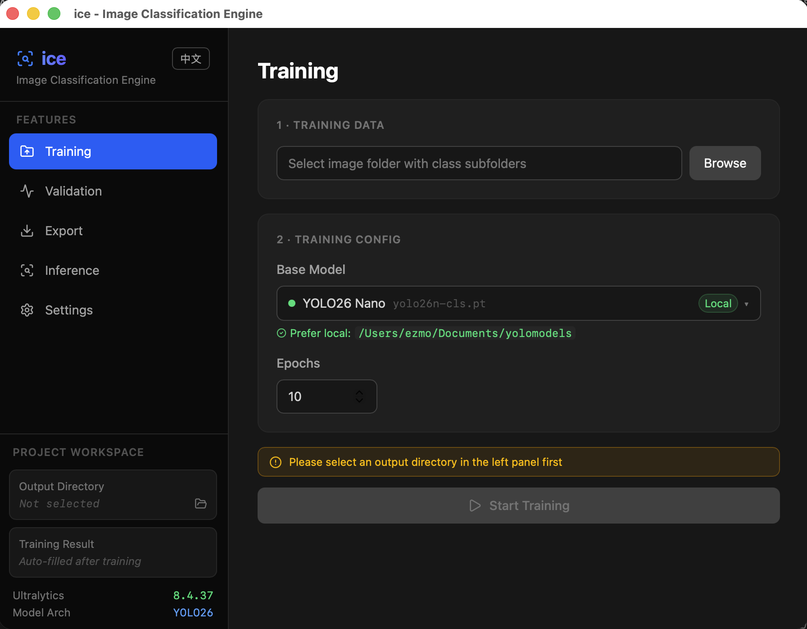
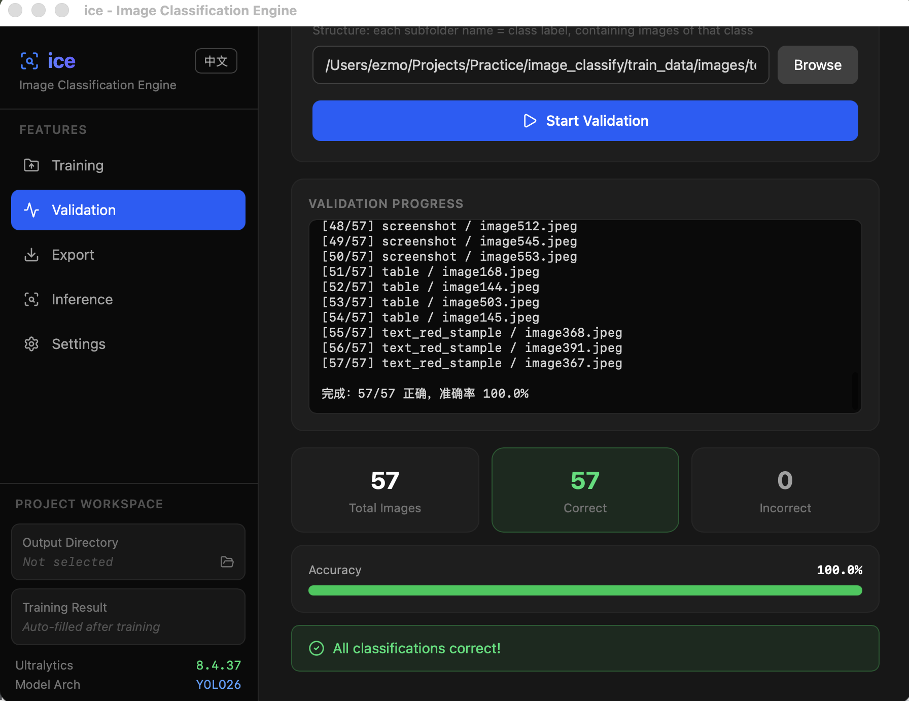
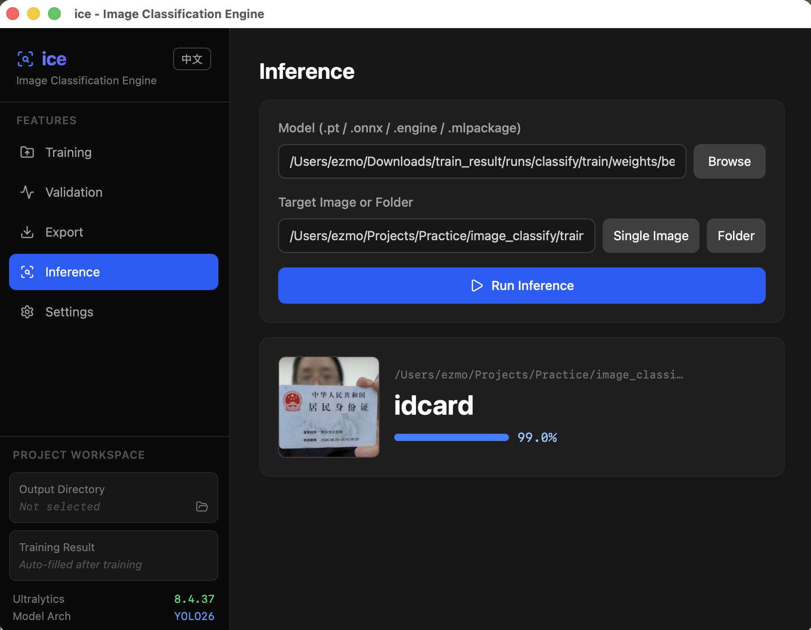

<p align="center">
  
</p>

<p align="center">
  <a href="README.md">English</a> | <strong>中文</strong>
</p>

# ice - Image Classification Engine

**ice**（Image Classification Engine）是一款基于 Tauri 2.0 框架和 Yolo26 模型的跨平台桌面级图片分类工具。该工具提供轻量化且美观的用户界面，简化了图片分类模型的训练、验证、导出和部署流程。

## 🌟 核心功能

1. **分类训练 (Training)**：支持用户上传带分类名称（子文件夹名即为分类标签）的图片文件夹，设置 Epoch 等参数，一键开始模型训练。
2. **模型验证 (Validation)**：支持选择验证集文件夹以及预训练/新训练的模型进行指标验证。
3. **格式导出 (Export)**：支持将训练后的模型 (.pt) 导出为业界通用的多种格式，如：
   - ONNX (`.onnx`)
   - TensorRT (`.engine`)
   - CoreML (`.mlpackage`)
4. **分类推理 (Inference)**：支持导入导出的 ONNX、TensorRT、CoreML 等模型，并上传单张图片或多张图片的文件夹进行批量分类推理。

## 🛠️ 技术栈

- **前端**：React 19 + TypeScript + Tailwind CSS v4 + Lucide Icons + Vite
- **客户端框架**：Tauri 2.0 (采用 Rust 驱动底层操作系统级能力，如原生文件系统选取及子进程调用)
- **底层推理/训练框架**：YOLO CLI (`ultralytics` 包)

## 🚀 启动与使用指南

### 环境准备

1. 请确保系统已安装 **Node.js** (推荐 >= 20)。
2. 请确保系统已安装 **Rust** 及其编译工具链。
3. 请确保系统已经通过 Python 安装了对应的 `yolo` (Ultralytics) 命令行工具，并且在环境变量 `PATH` 中：
   ```bash
   pip install ultralytics
   ```

### 运行开发服务器

在项目根目录下运行：

```bash
# 安装依赖
npm install

# 启动桌面开发版
npm run tauri dev
```

### 构建安装包

如需将其打包为独立的 macOS / Windows / Linux 应用程序：

```bash
npm run tauri build
```

## 📂 项目结构

- `/src`：React 前端页面、UI 组件逻辑。
- `/src-tauri`：Rust 后端与 Tauri 核心配置文件。
- `/src-tauri/src/lib.rs`：Yolo CLI 调用绑定、系统事件通讯。

## 📸 软件截图

<p align="center">
  
</p>
<p align="center">
  
</p>
<p align="center">
  
</p>
